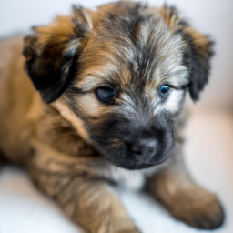

 

# OpenAI Image Generator

This is a simple [Node.JS](https://nodejs.org/en) app that uses [OpenAI's DALL-E model](https://openai.com/research/dall-e) to generate images from a prompt.

## Installation

```bash
git clone https://github.com/langedechu/node-dall-e.git
cd node-dall-e
npm i
```

After the installation, the program will run automatically with a template prompt.

## Usage

```bash
npm start <size> <prompt>
```

Where `<size>` is the size of the image in pixels and `<prompt>` is the prompt to generate the image from.

The only available sizes is `256`, `512` and `1024`.

The images are stored inside the `generated/` folder. They are named in the following format: `<current-timestamp>_<size>.png`

## Example

```bash
npm start 256 cute little puppy
```



Note that if there are no prompt and no size, the app will generate a funny `512x512` image about a cat trapped in a bowl 🐈 !

## License

[MIT](https://choosealicense.com/licenses/mit/)

## Note

This README was generated with the help of GitHub Copilot
